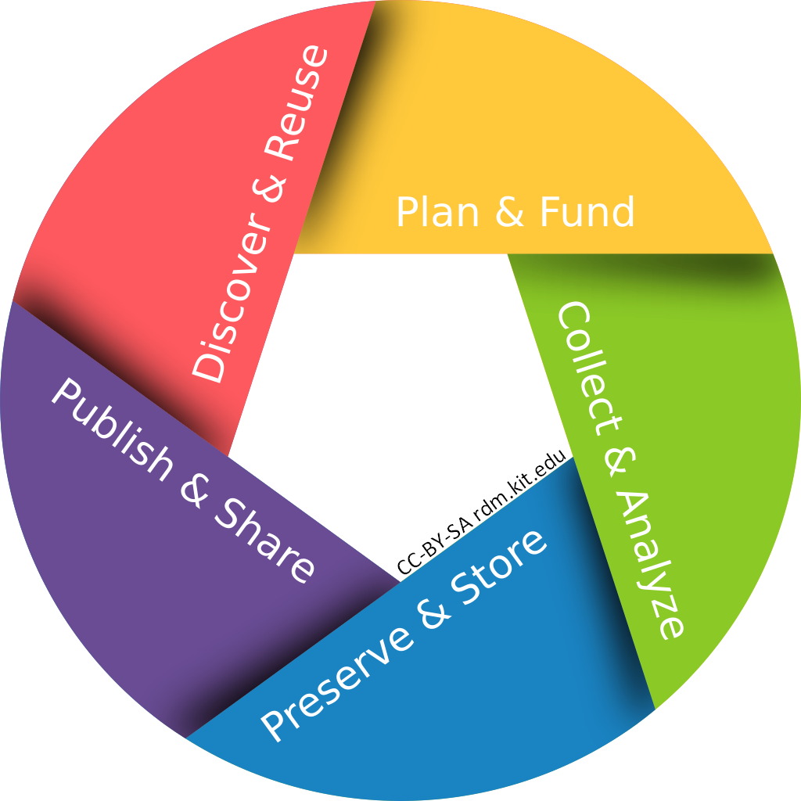

# 1.1 Introduction to Research Data Management

This section provides a short introduction into the principles of research data mangement. Its purpose is to provide the basic knowledge of research data management needed as a prerequisite for Chapter 2.

Please note that this section will not go into too much detail as there are many courses out there describing the principles of research data management. At the end of this section links will be provided about where you can find further information.

---

## Syllabus Elements
### Learning Objectives
At the end of the section the learners can ...

- **Describe** the basic principles of research data management
- **Explain** the FAIR principles

### Target Audience
- attendees of this course

### Duration
- time needed to learn the provided content

### Prerequisites
- Complete [00 Welcome](../00%20Welcome/Welcome_content.md)

### Learning Tools

- list any tools that are necessary to be used to complete the learning unit
- examples include required software, access to resources, etc.

---

## Learning Content Topic

### What is Research Data?

>The content in this section is adapted from the [DFG Guidelines on the Handling of Research Data](https://www.dfg.de/download/pdf/foerderung/grundlagen_dfg_foerderung/forschungsdaten/guidelines_research_data.pdf.).

"Research data is an essential foundation for scientific work. The diversity of this data reflects the wide range of different scientific disciplines, research interests and research methods. Research data might include measurement data, laboratory values, audiovisual information, texts, survey data, objects from collections, or samples that were created, developed or evaluated during scientific work. Methodical forms of testing such as questionnaires, software and simulations may also produce important results for scientific research and should therefore also be categorised as research data."

### Research data management

{: style="height:150px;"}

> [Research data cycle](https://www.rdm.kit.edu/english/researchdata_cycle.php) by [RDM@KIT](https://www.rdm.kit.edu/english/index.php) licensed under the [CC BY-SA 4.0 license](https://creativecommons.org/licenses/by-sa/4.0/)
### Why research data management?

"More than 70% of researchers have tried and failed to reproduce another scientist’s experiments, and more than half have failed to reproduce their own experiments." (Baker 2016)

"More than half pointed to insufficient replication in the lab" (Baker 2016)
### Good Research Practise

Overview policies https://www.rdm.kit.edu/english/researchdata_policies.php

### FAIR

### Persistent Identifiers (PIDs)

### Metadata
## Summary

At the end provide a short summary of the main points of the learning unit (these are the key takeaways that help reflect on the learning outcomes)

## Further information on RDM

- [Research Data Management at KIT RDM@KIT](https://www.rdm.kit.edu/english/index.php)
- [forschungsdaten.info](https://forschungsdaten.info/) (DE)
- [German National Research Data Infrastructure (NFDI)](https://www.nfdi.de/?lang=en)

## Tutorials on RDM

- [OpenCourse at KIT](https://opencourses.kit.edu/goto.php?target=crs_1206&client_id=opencourses)
- [forschungsdaten.info - overview on tutorials and materials](https://forschungsdaten.info/praxis-kompakt/tutorials-kurse-und-anleitungen/)(EN and DE)
- [forschungsdaten.info - calender](https://forschungsdaten.info/kalender-index/) (DE)
- [Helmholtz Information & Data Science Academy (HiDA)](https://www.helmholtz-hida.de/course-catalog/en/)

## Suggested Reading
- Deutsche Forschungsgemeinschaft (DFG) (2015): DFG Guidelines on the Handling of Research Data. [https://www.dfg.de/download/pdf/foerderung/grundlagen_dfg_foerderung/forschungsdaten/guidelines_research_data.pdf](https://www.dfg.de/download/pdf/foerderung/grundlagen_dfg_foerderung/forschungsdaten/guidelines_research_data.pdf).
- Deutsche Forschungsgemeinschaft (DFG) (2019): Guidelines for Safeguarding Good Research Practice. Code of Conduct. [https://doi.org/10.5281/zenodo.3923601](https://doi.org/10.5281/zenodo.3923601).
- Baker (2016): 1,500 scientists lift the lid on reproducibility. Nature 533 (7604), 452–454. [https://doi.org/10.1038/533452a](https://doi.org/10.1038/533452a).
- Perkel (2023): How to make your scientific data accessible, discoverable and useful. Nature 618 (7967), 1098–1099. [https://doi.org/10.1038/d41586-023-01929-7](https://doi.org/10.1038/d41586-023-01929-7).

