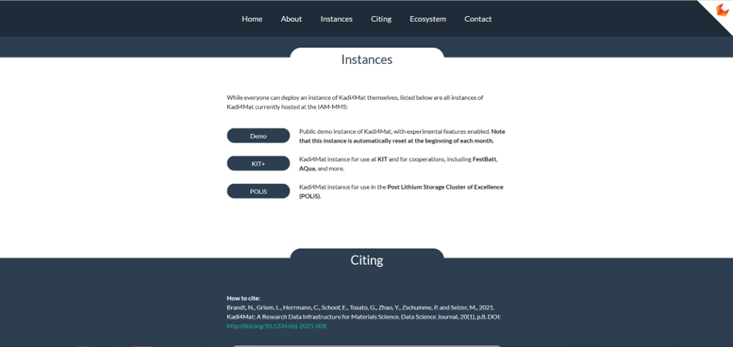
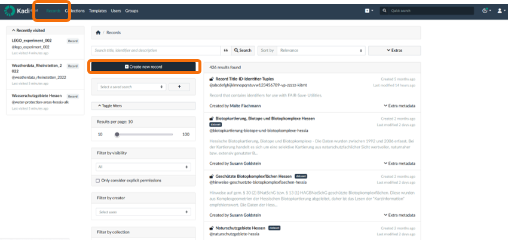
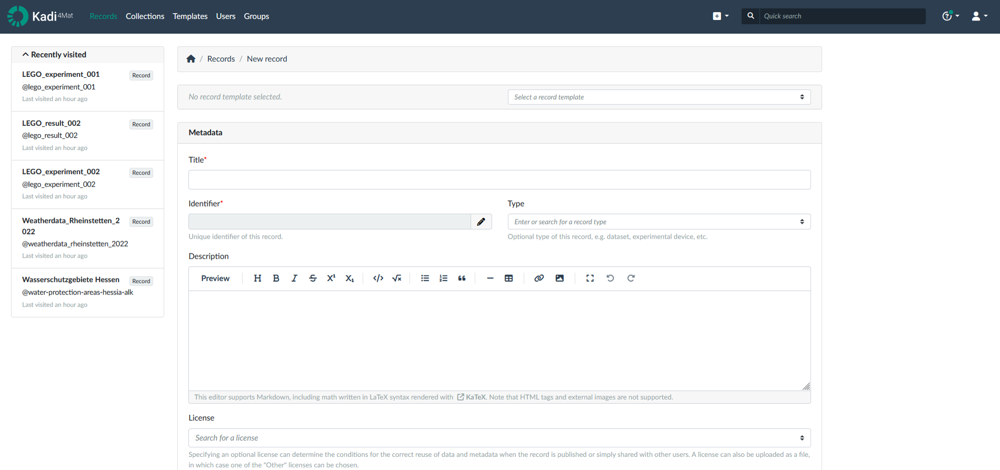

# 2.3 Example: Kadi4Mat

>The content in this section is adapted from [RDM@KIT](https://www.rdm.kit.edu/english/servicestools_tools_kadi4mat.php).

[Kadi4Mat](https://kadi.iam.kit.edu/) (Karlsruhe Data Infrastructure for Materials Science) is a virtual research environment (VRE) that was developed at KIT. It is used for the administration and analysis of research data from the research areas of materials science and macromolecular chemistry, but can also be used for other disciplines. Kadi4Mat is based on open source software. The modular and generic architecture with many interfaces makes it possible to meet the specific needs of different scientists from different research disciplines. Kadi4Mat is one of the tools of the [NFDI4Ing](https://nfdi4ing.de/community-hub-2/).

---

## Syllabus Elements

### Learning Objectives

At the end of the section the learners can ...

- **Recognizes** basic elements in the program Kadi4Mat
- **Define** use cases for Kadi4Mat 
- **Determine** whether Kadi4Mat is suitable for them
- **Knows** where to get further information on Kadi4Mat

### Target Audience
- attendees of this course

### Duration
- 15 minutes

### Prerequisites
- Complete 2.1 Introduction Electronic Lab Notebooks

### Learning Tools

- [Kadi4Mat](https://kadi.iam.kit.edu/)

---

## Learning Content Topic

### What is Kadi4Mat?

- [Kadi4Mat](https://kadi.iam.kit.edu/) stands for Karlsruhe Data Infrastructure for Materials Science
- Open Source Software
- Developed at the [Institute for Applied Materials (IAM)](https://www.iam.kit.edu/mms/) at KIT
- Generic ELN, originally from the field of Material Science but can be used from various disciplines
- One of the tools of the National Research Data Infrastructure for Engineering ([NFDI4Ing](https://nfdi4ing.de/de/))
- Uses a lot of interfaces to various programs

> The following section is adapted from [Kadi4Mat](https://kadi.iam.kit.edu/#ecosystem).

The goal of this project is to combine the ability to manage and exchange data, the _repository_ component, with the possibility to analyze, visualize and transform said data, the _electronic lab notebook_ (_ELN_) component.

#### Components

> The following section is adapted from [Kadi4Mat](https://kadi.iam.kit.edu/#ecosystem).

- **KadiWeb**: A web version of Kadi4Mat incorporating a classical ELN and a repository.
- **KadiStudio**: Design and execute your scientific workflows with KadiStudio, a flexible workflow editor. Use a wide range of existing or customized tools to create reproducible research.
- **KadiAPY:** A wrapper library called KadiAPY offers access to Kadi4Mat's HTTP API via Python, which follows an object oriented approach, and a Command Line Interface (CLI), as shown below. The library supports both Linux and Windows.
- **KadiFS:** Access and edit your data directly with the filesystem integration KadiFS based on FUSE. Connect your computers and devices to directly interface with the Kadi ecosystem.
- **KadiAI:** Integrate and implement your Artificial Intelligence (AI) and Machine Learning (ML) algorithms with KadiAI. Leverage interactive dashboards to design, train, and tune data-driven models or enhance your custom AI scripts with next-level research data management.

#### Hands-on Kadi4Mat
##### KadiWeb
- Go to the [Website](https://kadi.iam.kit.edu/) to the section [Instances](https://kadi.iam.kit.edu/#instances) and choose the [Demo version](https://demo-kadi4mat.iam.kit.edu)

- Create an account and then `Login`
- Create a record. Therefore click on `Records` and then on `Create record`

- No you can add your metadata like `Title`, `Type`, `Licence`, as well as Extra metadata.

- You can then also add files and data to your record, as well as connect them with other records, like experiments.
- If you want to build for example a car with LEGO, you can create multiple records and then collect them, to show, how to build a car. This connection can then be seen by clicking on `Links`.
 
##### KadiStudio
 
KadiStudio is a desktop based version of Kadi4Mat. Here you can add automatically data from your deviced. Then you can design Workflows that may include Python skripts for the analysis of your data.

## Summary

- Kadi4Mat is an ELN that was developed at KIT
- It is used for the administration and analysis of research data from the research areas of materials science and macromolecular chemistry, but can also be used for other disciplines.

## References
### Further information
- More information: [https://kadi.iam.kit.edu](https://kadi.iam.kit.edu)
- Source code: [https://gitlab.com/iam-cms/kadi](https://gitlab.com/iam-cms/kadi)
- Documentation:
    - Stable (reflecting the latest release): [https://kadi4mat.readthedocs.io/en/stable](https://kadi4mat.readthedocs.io/en/stable)
    - Latest (reflecting the current state): [https://kadi4mat.readthedocs.io/en/latest](https://kadi4mat.readthedocs.io/en/latest)
- [Contact](https://kadi.iam.kit.edu/#contact)
- [Twitter](https://twitter.com/Kadi4Mat)
- Want to test Kadi4Mat? Try the [demo](https://demo-kadi4mat.iam-cms.kit.edu/) [instance](https://demo-kadi4mat.iam-cms.kit.edu/)!
- Kadi4Mat in the [Helmholtz Research Software Directory](https://helmholtz.software/software/kadi4mat)
- Kadi4Mat in the [ELN Finder](https://eln-finder.ulb.tu-darmstadt.de/items/77f23b65-e027-48f4-859a-3a72dafd73af)
- Use of Kadi4Mat at the [Division MFM (TU Darmstadt)](https://tu-darmstadt.cloud.panopto.eu/Panopto/Pages/Viewer.aspx?id=e6eed9d2-fcd8-4c25-a306-aebd0146a59b) (Video)
- Use of Kadi4Mat in [POLiS](https://www.postlithiumstorage.org/en/research/rdm) (Video)

### Suggested reading

- Brandt et al. (2021): Kadi4Mat: A Research Data Infrastructure for Materials Science. In: Data Science Journal 20, Artikel 8. DOI: [https://doi.org/10.5334/dsj-2021-008](https://doi.org/10.5334/dsj-2021-008 "Artikel, Brandt et al.: Kadi4Mat").
- Griem et al. (2022): KadiStudio: FAIR Modelling of Scientific Research Processes. In: Data Science Journal 21, Artikel 16. DOI: [https://doi.org/10.5334/dsj-2022-016](https://doi.org/10.5334/dsj-2022-016).